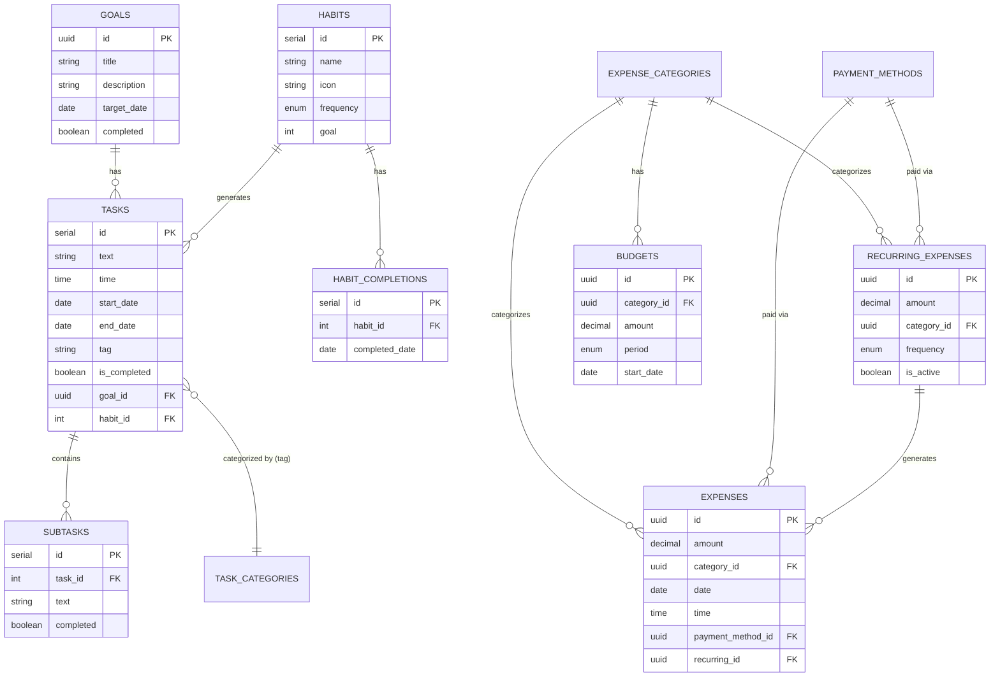

# Database Schema Documentation

This document serves as the single source of truth for the Organizer App's PostgreSQL database schema. It details all tables, relationships, data types, and constraints.

## Overview

- **Database Name**: `organizer` (default)
- **Schema**: `public`
- **RDBMS**: PostgreSQL 15+
- **Production Port**: 5435 (External), 5432 (Internal)

## Entity Relationship Diagram (ERD)



## Custom Enum Types

| Type Name | Values | Description |
|-----------|--------|-------------|
| `task_repeat_frequency` | `daily`, `weekly`, `monthly` | Frequency for repetitive tasks |
| `habit_frequency` | `daily`, `weekly` | Frequency for habit tracking |
| `expense_frequency` | `daily`, `weekly`, `monthly`, `yearly` | Frequency for recurring expenses |
| `budget_period` | `weekly`, `monthly` | Time period for budget limits |

## Tables

### 1. Goals
Long-term objectives that can have multiple tasks associated with them.

| Column | Type | Constraints | Description |
|--------|------|-------------|-------------|
| `id` | UUID | PK, Default: `gen_random_uuid()` | Unique identifier |
| `title` | VARCHAR(255) | NOT NULL | Goal title |
| `description` | TEXT | | Detailed description |
| `target_date` | DATE | | Expected completion date |
| `completed` | BOOLEAN | Default: `FALSE` | Completion status |
| `created_at` | TIMESTAMP | Default: `CURRENT_TIMESTAMP` | Creation timestamp |
| `updated_at` | TIMESTAMP | Default: `CURRENT_TIMESTAMP` | Last update timestamp |

**Indexes:**
- `idx_goals_completed` on `completed`
- `idx_goals_created_at` on `created_at DESC`

---

### 2. Task Categories
Predefined categories for tasks (used as tags).

| Column | Type | Constraints | Description |
|--------|------|-------------|-------------|
| `id` | SERIAL | PK | Unique identifier |
| `name` | VARCHAR(100) | NOT NULL, UNIQUE | Category name |
| `color` | VARCHAR(7) | NOT NULL | Hex color code (e.g., '#FF0000') |
| `created_at` | TIMESTAMP | Default: `CURRENT_TIMESTAMP` | Creation timestamp |

**Default Data:**
- Work (#5590f7)
- Personal (#22c55e)
- Health (#ef4444)
- Study (#f59e0b)
- Shopping (#8b5cf6)

---

### 3. Habits
Habits to be tracked over time.

| Column | Type | Constraints | Description |
|--------|------|-------------|-------------|
| `id` | SERIAL | PK | Unique identifier |
| `name` | VARCHAR(255) | NOT NULL | Habit name |
| `icon` | VARCHAR(100) | NOT NULL | Material Symbols icon name |
| `frequency` | `habit_frequency` | NOT NULL, Default: 'daily' | Tracking frequency |
| `goal` | INTEGER | NOT NULL, Default: 1 | Target completions per period |
| `created_at` | TIMESTAMP | Default: `CURRENT_TIMESTAMP` | Creation timestamp |
| `updated_at` | TIMESTAMP | Default: `CURRENT_TIMESTAMP` | Last update timestamp |

---

### 4. Habit Completions
Records of when a habit was completed.

| Column | Type | Constraints | Description |
|--------|------|-------------|-------------|
| `id` | SERIAL | PK | Unique identifier |
| `habit_id` | INTEGER | NOT NULL, FK -> `habits(id)` | Parent habit |
| `completed_date` | DATE | NOT NULL | Date of completion |
| `created_at` | TIMESTAMP | Default: `CURRENT_TIMESTAMP` | Record creation time |

**Constraints:**
- `UNIQUE(habit_id, completed_date)`: Prevents duplicate completions for the same day.
- `ON DELETE CASCADE`: Deleting a habit deletes all its completions.

---

### 5. Tasks
Actionable items, to-dos, or events.

| Column | Type | Constraints | Description |
|--------|------|-------------|-------------|
| `id` | SERIAL | PK | Unique identifier |
| `text` | VARCHAR(500) | NOT NULL | Task title/content |
| `time` | TIME | | Scheduled time |
| `start_date` | DATE | | Start date |
| `end_date` | DATE | | Due date |
| `tag` | VARCHAR(100) | | Category name (denormalized) |
| `tag_color` | VARCHAR(7) | | Category color (denormalized) |
| `is_completed` | BOOLEAN | Default: `FALSE` | Completion status |
| `description` | TEXT | | Detailed notes |
| `goal_id` | UUID | FK -> `goals(id)` | Linked goal (optional) |
| `habit_id` | INTEGER | FK -> `habits(id)` | Linked habit (optional) |
| `is_repetitive` | BOOLEAN | Default: `FALSE` | If task repeats |
| `repeat_frequency` | `task_repeat_frequency` | | Repetition interval |
| `created_at` | TIMESTAMP | Default: `CURRENT_TIMESTAMP` | Creation timestamp |
| `updated_at` | TIMESTAMP | Default: `CURRENT_TIMESTAMP` | Last update timestamp |

**Constraints:**
- `ON DELETE SET NULL` for `goal_id` and `habit_id`.

---

### 6. Subtasks
Smaller steps within a task.

| Column | Type | Constraints | Description |
|--------|------|-------------|-------------|
| `id` | SERIAL | PK | Unique identifier |
| `task_id` | INTEGER | NOT NULL, FK -> `tasks(id)` | Parent task |
| `text` | VARCHAR(500) | NOT NULL | Subtask content |
| `completed` | BOOLEAN | Default: `FALSE` | Completion status |
| `position` | INTEGER | Default: 0 | Ordering position |
| `created_at` | TIMESTAMP | Default: `CURRENT_TIMESTAMP` | Creation timestamp |

**Constraints:**
- `ON DELETE CASCADE`: Deleting a task deletes all subtasks.

---

### 7. Expense Categories
Categories for financial transactions.

| Column | Type | Constraints | Description |
|--------|------|-------------|-------------|
| `id` | UUID | PK, Default: `gen_random_uuid()` | Unique identifier |
| `name` | VARCHAR(100) | NOT NULL | Category name |
| `icon` | VARCHAR(100) | NOT NULL | Material Symbols icon name |
| `color` | VARCHAR(7) | NOT NULL | Hex color code |
| `is_custom` | BOOLEAN | Default: `TRUE` | If user-created |
| `created_at` | TIMESTAMP | Default: `CURRENT_TIMESTAMP` | Creation timestamp |

**Default Data:**
- Food & Dining (#ef4444)
- Transportation (#3b82f6)
- Shopping (#8b5cf6)
- Entertainment (#ec4899)
- Healthcare (#22c55e)
- Bills & Utilities (#f59e0b)
- Education (#06b6d4)
- Other (#6b7280)

---

### 8. Payment Methods
Methods used for payments.

| Column | Type | Constraints | Description |
|--------|------|-------------|-------------|
| `id` | UUID | PK, Default: `gen_random_uuid()` | Unique identifier |
| `name` | VARCHAR(100) | NOT NULL | Method name |
| `icon` | VARCHAR(100) | NOT NULL | Icon name |
| `created_at` | TIMESTAMP | Default: `CURRENT_TIMESTAMP` | Creation timestamp |

**Default Data:**
- Cash
- Credit Card
- Debit Card
- Mobile Payment
- Bank Transfer

---

### 9. Recurring Expenses
Subscriptions and recurring bills.

| Column | Type | Constraints | Description |
|--------|------|-------------|-------------|
| `id` | UUID | PK, Default: `gen_random_uuid()` | Unique identifier |
| `amount` | DECIMAL(10, 2) | NOT NULL | Expense amount |
| `category_id` | UUID | NOT NULL, FK -> `expense_categories` | Category |
| `description` | TEXT | | Description |
| `frequency` | `expense_frequency` | NOT NULL | Repetition interval |
| `start_date` | DATE | NOT NULL | Start date |
| `end_date` | DATE | | End date (optional) |
| `payment_method_id` | UUID | FK -> `payment_methods` | Payment method |
| `tags` | TEXT[] | | Array of tags |
| `is_active` | BOOLEAN | Default: `TRUE` | Active status |
| `last_generated` | DATE | | Last time expense was generated |
| `created_at` | TIMESTAMP | Default: `CURRENT_TIMESTAMP` | Creation timestamp |
| `updated_at` | TIMESTAMP | Default: `CURRENT_TIMESTAMP` | Last update timestamp |

---

### 10. Expenses
Individual financial transactions.

| Column | Type | Constraints | Description |
|--------|------|-------------|-------------|
| `id` | UUID | PK, Default: `gen_random_uuid()` | Unique identifier |
| `amount` | DECIMAL(10, 2) | NOT NULL | Expense amount |
| `category_id` | UUID | NOT NULL, FK -> `expense_categories` | Category |
| `date` | DATE | NOT NULL | Transaction date |
| `time` | TIME | NOT NULL | Transaction time |
| `description` | TEXT | | Description |
| `payment_method_id` | UUID | FK -> `payment_methods` | Payment method |
| `attachment_url` | VARCHAR(500) | | Receipt/File URL |
| `tags` | TEXT[] | | Array of tags |
| `recurring_id` | UUID | FK -> `recurring_expenses` | Source recurring expense |
| `created_at` | TIMESTAMP | Default: `CURRENT_TIMESTAMP` | Creation timestamp |
| `updated_at` | TIMESTAMP | Default: `CURRENT_TIMESTAMP` | Last update timestamp |

---

### 11. Budgets
Spending limits per category.

| Column | Type | Constraints | Description |
|--------|------|-------------|-------------|
| `id` | UUID | PK, Default: `gen_random_uuid()` | Unique identifier |
| `category_id` | UUID | NOT NULL, FK -> `expense_categories` | Category |
| `amount` | DECIMAL(10, 2) | NOT NULL | Budget limit |
| `period` | `budget_period` | NOT NULL | Budget period |
| `start_date` | DATE | NOT NULL | Start of budget period |
| `created_at` | TIMESTAMP | Default: `CURRENT_TIMESTAMP` | Creation timestamp |
| `updated_at` | TIMESTAMP | Default: `CURRENT_TIMESTAMP` | Last update timestamp |

**Constraints:**
- `UNIQUE(category_id, period, start_date)`: One budget per category per period.

---

## Triggers

### `update_updated_at_column`
Automatically updates the `updated_at` column to `CURRENT_TIMESTAMP` on every `UPDATE` operation for the following tables:
- `goals`
- `tasks`
- `habits`
- `expenses`
- `recurring_expenses`
- `budgets`

## Database Initialization

To initialize the database with this schema, run the following command from the `backend` directory:

```bash
node scripts/init-database.js
```

This script executes the SQL commands found in `scripts/init-db.sql`.
